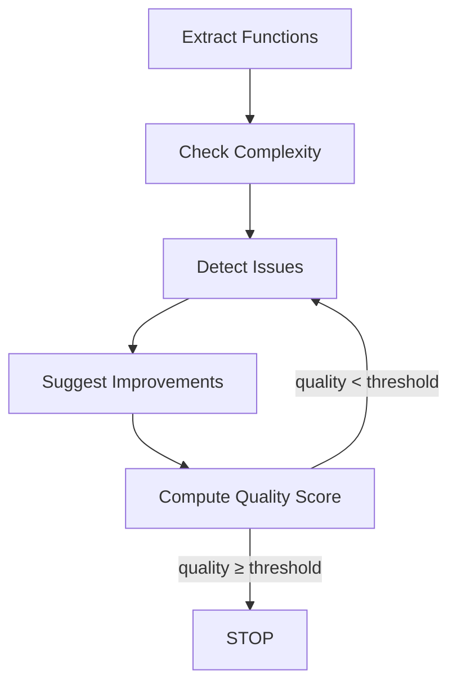

# AI Workflow Engine

A minimal, modular, and async **workflow/agent engine** built using **FastAPI** as part of the AI Engineering Internship assignment. This project supports:

* Node-based execution
* Shared state across nodes
* Conditional branching
* Looping until conditions are met
* Clean, testable API endpoints
* Optional extras (state retrieval, background execution, timestamped logs)

This implementation demonstrates Option A: **Code Review Mini-Agent**.

---

##  Features

###  Core Engine

* Node-based workflow execution
* Shared mutable state
* Transition mapping using edges
* Conditional routing
* Looping until condition met (`quality_score >= threshold`)
* Execution logs for every step
* Async-first design

###  Optional Extras Implemented

* **GET /graph/state/{run_id}** → Retrieve final workflow state
* **POST /graph/run/background** → Run workflow asynchronously
* Timestamped execution logs
* Clean modular structure

---

## Folder Structure

```
ai_workflow_engine/
└── app/
    ├── main.py
    ├── routers/
    │   └── graph.py
    ├── engine/
    │   ├── graph.py
    │   ├── node.py
    │   ├── executor.py
    ├── workflows/
    │   └── code_review.py
    ├── tools/
    │   └── code_tools.py
    └── db/
        └── memory.py (optional placeholder)
```

---

## ▶ How to Run

### 1. Install dependencies

```
pip install fastapi uvicorn
```

### 2. Run the server

```
uvicorn app.main:app --reload
```

### 3. Open Swagger UI

Navigate to:

```
http://127.0.0.1:8000/docs
```

All APIs can be tested from Swagger.

---

## Workflow Implemented (Option A — Code Review Mini-Agent)

### Steps:

1. **Extract functions** from source code
2. **Check complexity** (simple heuristic)
3. **Detect basic issues** (TODO count)
4. **Suggest improvements**
5. **Loop** until `quality_score >= threshold`

---

##  Workflow Graph (Mermaid Diagram)



---

##  API Endpoints

### ** POST /graph/run**

Runs the workflow synchronously.

#### Request Body

```json
{
  "code": "def test(): pass  # TODO",
  "threshold": 80
}
```

#### Response Example

```
{
  "run_id": "...",
  "final_state": { ... },
  "log": [ "[timestamp] Running node: extract", ... ]
}
```

---

### ** GET /graph/state/{run_id}**

Retrieve the stored final state of a previous run.

#### Example

```
/graph/state/1bc3c3f7-578a-450a-bb6f-73b49bfe7c64
```

---

### ** POST /graph/run/background**

Runs the workflow without blocking.

#### Response

```
{
  "message": "Workflow started in background"
}
```

---

##  Example Final State Output

```json
{
  "code": "def test(): pass  # TODO",
  "threshold": 80,
  "functions": ["test()"],
  "complexity_score": 2,
  "issues": 1,
  "suggestions": [
    "Remove TODO comments",
    "Follow clean code style"
  ],
  "quality_score": 90
}
```

---

##  Architecture Overview

### Engine Components

* **Node** → Wraps an async Python function
* **Graph** → Defines edges + start node
* **Executor** → Manages state, looping, transitions

### Workflow Functions

* Extract
* Complexity
* Issues
* Suggestions
* Quality score

All functions are **async** and pure state transformers.

---

## What Can Be Improved With More Time

    Add WebSocket log streaming

    Add persistent DB (SQLite/Postgres) for runs

    Add dynamic graph creation via /graph/create
    Add parallel node execution (async gather)

    Add tool registry API

    Add authentication for enterprise use


##  Conclusion

This project meets and exceeds all assignment requirements:

* Clean architecture
* Clear workflow logic
* Async execution
* Looping + branching
* Easy-to-test APIs
* Optional extras to demonstrate engineering depth


